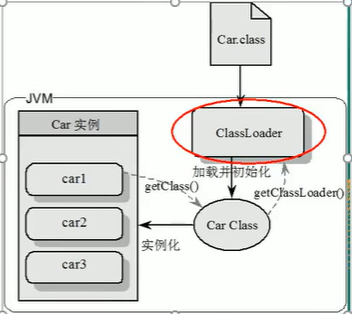
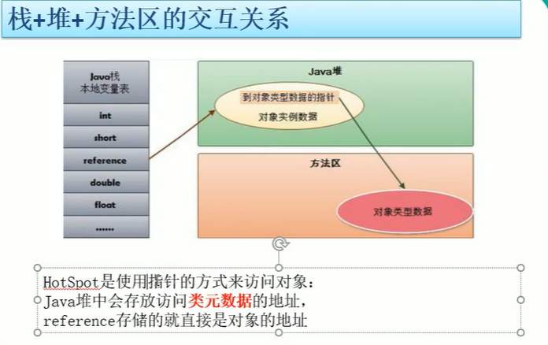
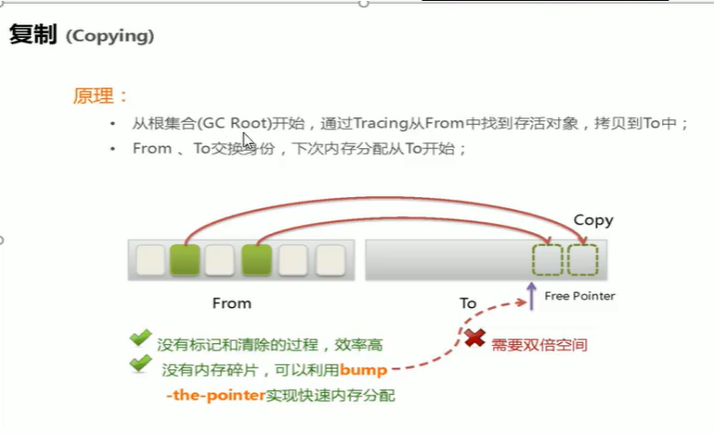
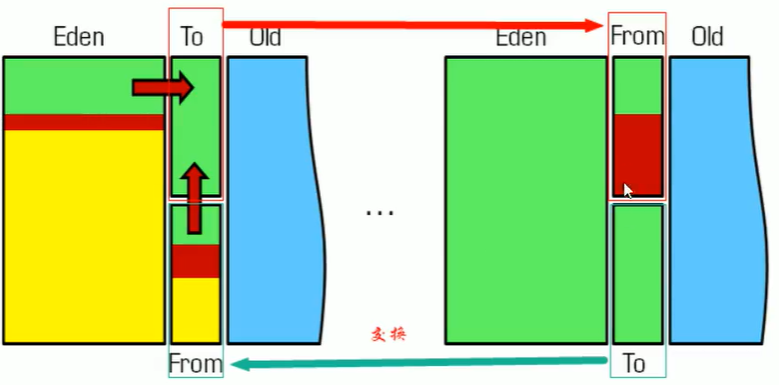
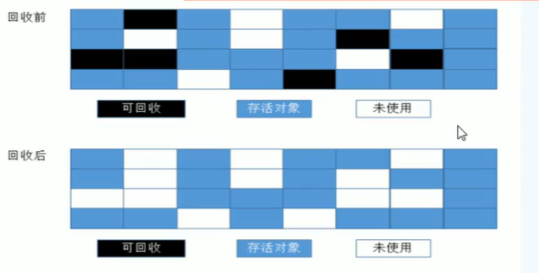
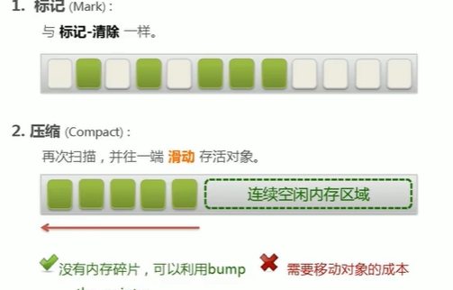

# JVM内存结构
##类加载器

负责加载class，class文件在文件开头有特定的文件标示，将class字节码加载到内存在，并将这些内容转换成内存中方法区中的运行时数据结构，并且ClassLoader
只负责class文件加载，至于他是否可以运行，由Execution Engine决定    
### 虚拟机自带的加载器  
1.启动类加载器（Bootstrap）C++   
2.扩展类加载器（Extension）Java  
3.应用程序类加载器（AppClassLoader） 加载当前应用的classpath的所有类   
### 用户自定义加载器
Java.lang.ClassLoader的子类，用户可以定制类的加载方法
####双亲委派机制
从爷爷辈开始找，一层一层向下找，最终没找到的话报class not found error  
当一个类收到了类加载器的请求，它首先不会尝试自己去加载这个类，而是把这个请求委派给父类去完成，每一层次类加载器都是如此，因此所有的请求都应该传递到
启动类加载其中，只有当父亲加载器反馈自己无法完成这个请求时候，子类加载器才会尝试自己去加载   
采用双亲委派的一个好处是比如加载位于rt.jar包中的类java.lang.Object，不管是哪个加载器加载这个类，最终都是委托给顶层的启动类加载器进行加载，这样
就保证了使用不同类加载器最终得到的都是同样一个Object对象（沙箱安全，防止自己瞎几把写的类破坏原生类）    

##运行时内存
###方法区
所有线程共享，很少垃圾回收    
供各线程共享的运行时内存区域，它存储了每一个**类的结构信息**，例如运行时常量池、字段和方法数据、构造函数和普通方法的字节码内容       
实例变量存在堆内存中，和方法区无关      
###**堆**
**堆管存储**     

一个JVM实例只存在一个堆内存，堆内存的大小是可以调节的。类加载器读取了类文件后，把类、方法、常变量放入堆内存中，保存所有引用类型的真实信息，
以便执行器执行      
逻辑上分为：新生+养老+（永久）元空间     
硬件上分为：新生+养老     
####新生区(1/3)堆空间
Eden(8/10)    
S0=from(1/10)    
S1=to(1/10)     
from区和to区，他们位置和名分不是固定的，每次GC后会交换    
GC之后有交换，谁空谁是to    
##### MinorGC的过程（复制--》清空--》交换）   
1.eden，SurvivorFrom复制到SurvivorTo，年龄+1   
首先，当Eden区满了时候会触发第一次GC，把还活着的对象拷贝到SurvivorFrom区，当Eden区再次触发GC是会扫描Eden区和From区，堆这两个区域进行垃圾回收，
经过这次回收后还存活的对象，则直接复制到To区（如果有对象的年龄已经达到了老年的标准，则赋值到老年区），同时把这些对象的年龄+1    
2.清空Eden、SurvivorFrom    
清空Eden、SurvivorFrom中的对象，也即复制之后有交换，谁空谁是to   
3.SurvivorTo和SurvivorFrom互换
SurvivorTo和SurvivorFrom互换，原SurvivorTo成为下一次GC的SurvivorFrom。部分对象会在From和To区域中复制来复制去，如此交换15次
（由JVM参数MaxTenuringThreshold决定，这个参数默认是15），最终如果还是存活，就进入老年代     
####养老区(2/3)堆空间
####永久区（java7）
一个常驻内存区域，用于存放JDK自身所携带的Class，Interface的元数据，也就是说它存储的是运行环境必须的类信息，被装载进此区域的数据是不会被
垃圾回收器回收掉的，关闭JVM才会释放此区域所占用的内存    
####元空间（java8）
在JAVA8中，永久代已经被移除，被一个称之为元空间的区域所取代，元空间本质和永久代类似    
与永久代最大的区别是：
永久代使用的JVM堆内存，但是JAVA8之后的元空间并不在虚拟机中而是使用本机物理内存。    
因此默认情况下，元空间大小仅受本地内存限制，类元数据放入native memory，字符串池和类的静态变量放入JAVA堆中，这样可以加载多少类的元数据就不再由
MaxPermSize控制，而由系统的实际可用空间来控制     
####堆空间调优参数
-Xms：设置初始分配大小，默认为物理内存的“1/64”   
-Xmx：最大分配内存，默认为物理内存的“1/4”     
-XX:PrintGCDetails：输出详细的GC处理日志      

###**JAVA栈**
**栈管运行**     
栈内存，主管JAVA程序的运行，是在线程创建时创建，它的生命期时跟随线程的生命期，线程结束栈内存也就释放，对于栈来说，不存在垃圾回收问题，只要线程一结束，
该栈就Over，生命周期和线程一直，时线程私有。8种基本类型的变量+对象的引用变量+实例方法都是在函数的栈内存中分配    

####栈存储什么
1.本地变量：输入参数和输出参数以及方法内的变量  
2.栈操作：记录出栈、入栈操作   
3.栈帧数据：包括类文件、方法等     
java方法=栈帧    
每个方法执行的同时都会创建一个栈帧，用于存储局部变量表、操作数栈、动态链接、方法出口等信息，每个方法从调用直至执行完毕的过程，就对应着一个栈帧在虚拟
中入栈到出栈的过程。栈的大小和具体的JVN的实现有关，通常在256-756kb之间，即1M左右

###本地方法栈（native method stack）
登记native方法，在Execution Engine执行时加载本地方法库    
###程序计数器(寄存器)   
排班值日表   
一个指针，当前方法执行完指向下一个方法   
每个线程都有一个程序计数器，是线程私有的，就是一个指针，指向方法区中的方法字节码（用来存储指向下一条指令的地址，也即将要执行的指令代码），由执行引擎
读取下一条指令，是一个非常小的内存空间，几乎可以忽略不记   
这块内存区域很小，它是当前线程所执行的字节码的行号指示器，字节码解释器通过改变这个计数器的值来选取下一条需要执行的字节码指令    
如果执行的是一个Native方法，那这个计数器是空的    
用以完成分支、循环、跳转、异常处理、线程恢复等基础功能，不会发生内存溢出错误（OOM）      
###本地方法接口（native interface）
native 修饰的方法都放在本地方法栈（native method stack）中    
本地接口的作用是融合不同的编程语言为JAVA所用，它的初衷是融合C/C++程序，它在内存中专门开辟了一块区域处理标记native的代码，它的具体做法是Native 
Method Stackd中登记native方法，在Execution Engine执行时加载native libraies     

##栈+堆+方法区的交互关系

HotSpot是使用指针的方式来访问对象   
JAVA堆中会存放访问类元素的地址    
reference存储的就直接是对象的地址     

#String 在常量区

#GC
次数上频繁收集Young区    
次数上较少收集Old区        
基本不动元区    
JVM在进行GC时，并非每次都对上面三个内存区域一起回收，大部分是否回收的都是新生代   
因此GC按照回收的区域又划分成了两种类型，一种是普通GC（minor GC）,一种是全局GC（major/Full GC）     
##普通GC
只针对新生代区域，发生在新生代的垃圾回收动作，因为大多数Java对象存活率不高，所以Minor GC非常频繁，一般回收速度也比较快     
##全局GC
发生在老年代的垃圾回收动作，出现了Major GC，经常会伴随至少一次的Minor GC，速度比Minor GC慢上10倍以上       
##GC算法
###引用计数法
每次对对象赋值时均要维护引用计数器，且计数器本身也有一定消耗   
较难处理循环引用    
###复制算法
Young GC 中就使用的这种算法， 基本思想就是将内存分为两块，每次只用其中一块，当这一块内存用完，就将还活着的对象复制到另外一块上面，
复制算法**不会产生内存碎片**，空间换时间    

缺点：
浪费了一半的内存   
如果对象的存活率很高，假如100%存活，我们需要将所有对象都复制一遍，并将所有引用地址重置一遍，复制这一工作所花费的时间，在对象存活率到达一定程度时，
将会变得不可忽视。       

###标记清除
老年代一般是由标记清除或者是标记清除与标记整理的混合算法。    
算法分为：
标记和清除两个阶段    
先标记出要回收的对象，然后统一回收这些对象      

节约了空间，但是两次扫描，**耗时严重**，
**会产生内存碎片**     

###标记压缩
标记，压缩，清除

#JVM规定 静态代码块 > 构造块 > 构造方法