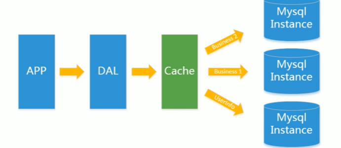
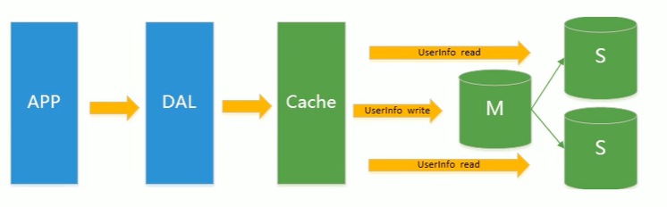
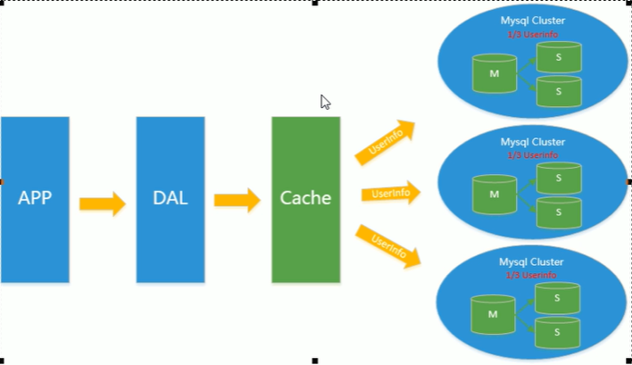

#历史遗留问题
##Memcached(缓存)+MYSQL+垂直拆分
随着访问量上升，几乎大部分使用MYSQL架构的网站在数据库上都出现了性能问题，开始使用缓存技术来缓解数据库的压力，优化数据库的结构和索引，比较流行的方法
是通过文件缓存来缓解数据库压力，但是当访问量继续增大的时候，多台web机器通过文件缓存不能共享，大量的小文件缓存也带来了比较高的IO压力，因此Memcached
成为流行技术      

##Mysql贮存读写分离
由于数据库写入压力增加，Memcached只能缓解数据库的读取压力，读写集中在一个数据库上让数据库不堪重任，     
因此开始使用主从复制技术达到读写分离，以提高读写性能和读库的可拓展性。主扩插一条后从扩们立马插入，

##分表分库——水平拆分+mysql集群
在前两个基础上，Mysql主库的写压力开始出现瓶颈，而数据量的持续猛增，由于MyISAM使用表锁，在高并发下会出现严重的锁问题，大量的高并发Mysql应用开始
使用InnoDB引擎代替MyISAM     
同时，开始流行使用分表分库来缓解写压力和数据增长的拓展问题，这个时候，分表分库成为了热门技术，Mysql虽然推出了Mysql cluster集群，但性能也不能很好
满足互联网需求，只是在高可靠性上提高了保证    

##mysql的拓展性瓶颈
大数据存储